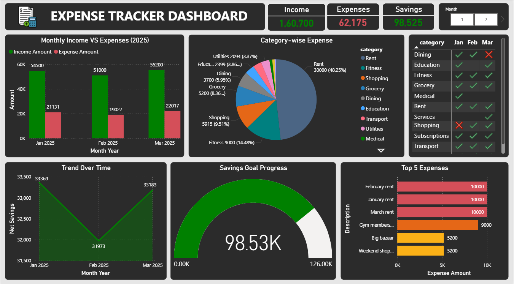

# Expense Tracker Analysis Project

This is a data analysis project focused on analyzing expenses and personal finances using **Excel, SQL, Python, and Power BI**.

---

## Project Structure

├── .env # Environment variables (not uploaded)
├── .gitignore # Git ignore rules
├── Expenses.xlsx # Cleaned expense data
├── Income.xlsx # Cleaned income data
├── Savings.xlsx # Cleaned savings data
├── FinanceTracker.sql # SQL queries used
├── Finance_Tracker.py # Python scripts for analysis
├── ExpenseDashboard.pbix # Power BI dashboard (local only)
├── Dashboard1-img.PNG # Screenshot of the dashboard
└── README.md # Project documentation

---

## Tools Used

- **Microsoft Excel** – for initial data exploration  
- **SQL** – to clean, filter, and analyze data  
- **Python (Pandas, Matplotlib)** – for deeper analysis and visualizations  
- **Power BI** – for interactive dashboard and insights  

---

## Key Insights

- Rent dominates spending, accounting for nearly **48%** of total expenses.  
- Expenses peaked in March but remained below **₹23,000** each month.  
- Monthly savings remained consistent, averaging around **₹33,000**.  
- **Fitness (₹9,000)** and **Shopping (₹5,915)** are major variable expenses after rent.  

---

## Dashboard Preview

---

## Note

- `.env` file and sensitive credentials are excluded using `.gitignore`

---

## Author

**Jency J C** – Aspiring Data Analyst  
[LinkedIn Profile](https://www.linkedin.com/in/jency-j-c-237942221/)
